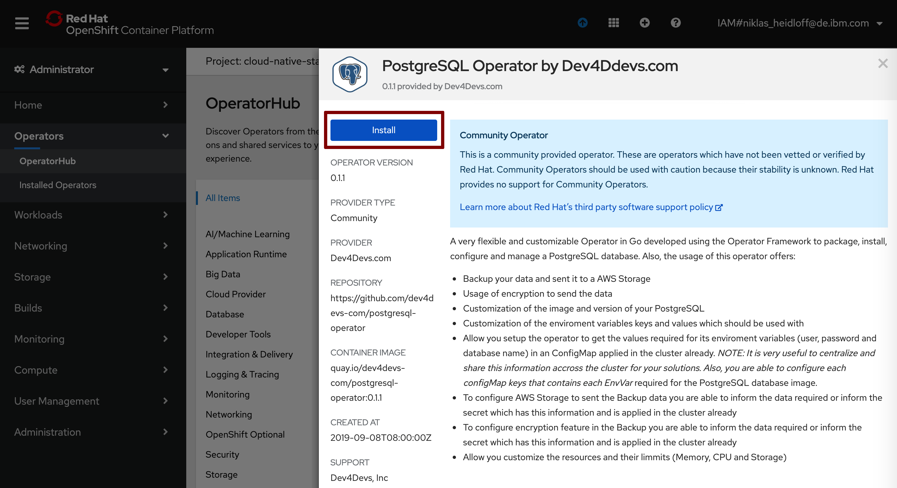
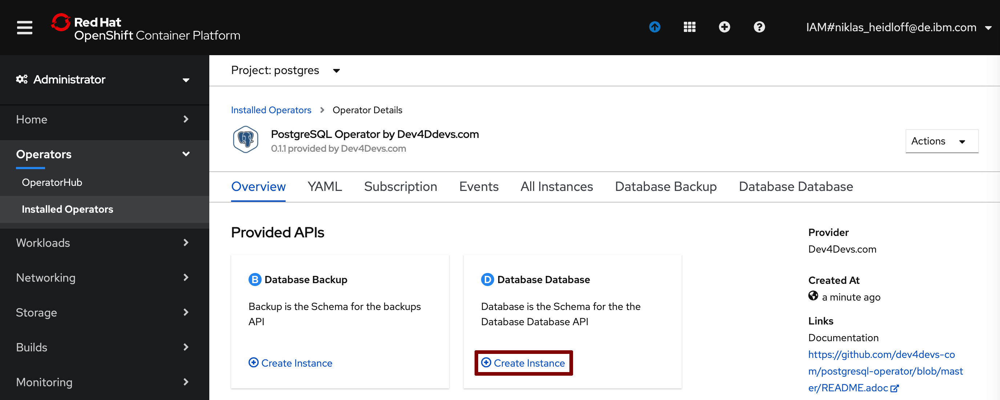
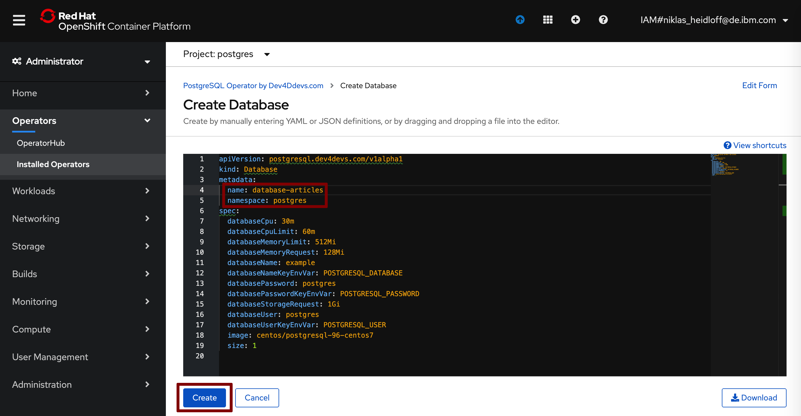
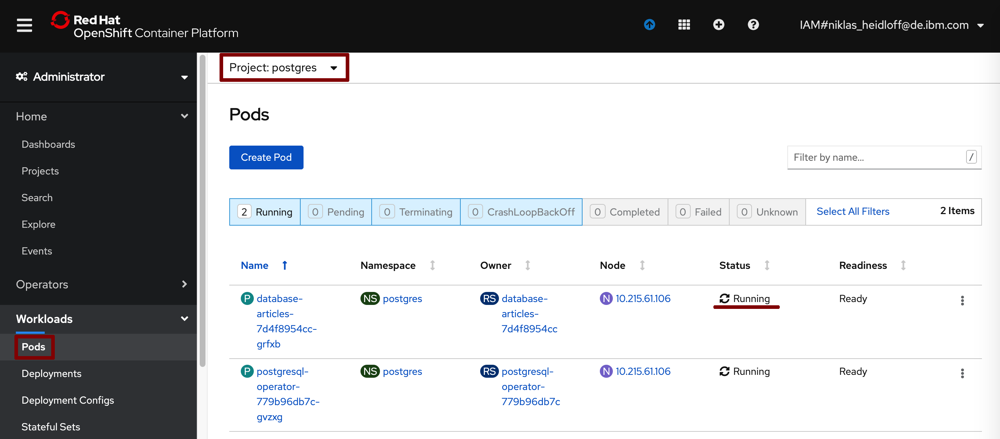

Navigator:
* [Workshop Description](https://nheidloff.github.io/workshop-quarkus-openshift-reactive-messaging/)
* Lab 1: [Create your Cloud Environment](lab1.md)
* Lab 2: [Deploy Kafka via Script](lab2.md)
* Lab 3: Deploy Postgres via Operator
* Lab 4: [Deploy Sample Application](lab4.md)
* Lab 5: [Reactive Messaging with MicroProfile](lab5.md)
* Lab 6: [Server Sent Events](lab6.md)
* Lab 7: [Vert.x Event Bus](lab7.md)

---

# Lab 3: Deploy Postgres via Operator

In this lab you'll deploy Postgres and set up a database which is used by the 'Articles' service.

### Step 1: Create Project

In the Cloud Shell enter the following command.

```
$ oc new-project postgres
```


### Step 2: Install the Postgres Operator

Open the OperatorHub page and filter by 'postgres'. Open the operator 'PostgreSQL Operator by Dev4devs.com'.


Click 'Install'.



Create a subscription. Make sure your new project 'postgres' is selected in the combobox.


### Step 3: Create the Database

Click on the operator.


Click on 'Create Instance' in the 'Database Database' box.



Edit the yaml. The database name needs to be changed to  'database-articles'. The namespace should be 'postgres' by default. After this click 'Create'.



### Step 4: Verify the Installation 

On the 'Pods' page select the project 'postgres'. Make sure the pod 'database-articles....' is running.



---

__Continue with [Lab 4: Deploy Sample Application](lab4.md)__
