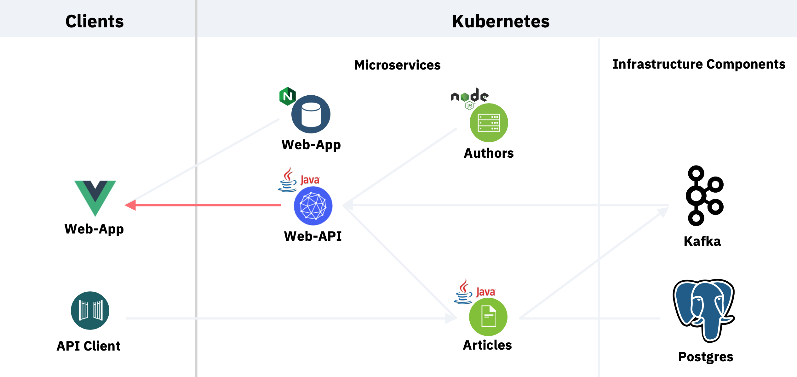
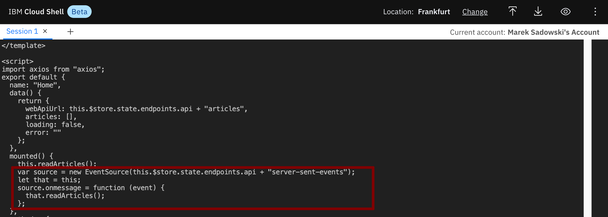
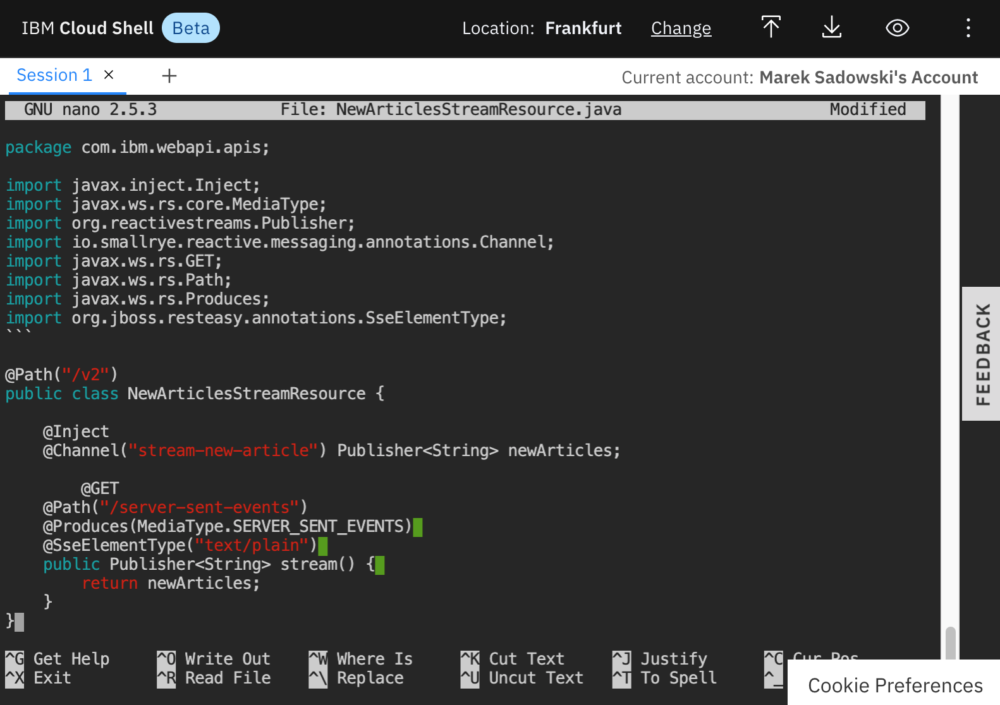
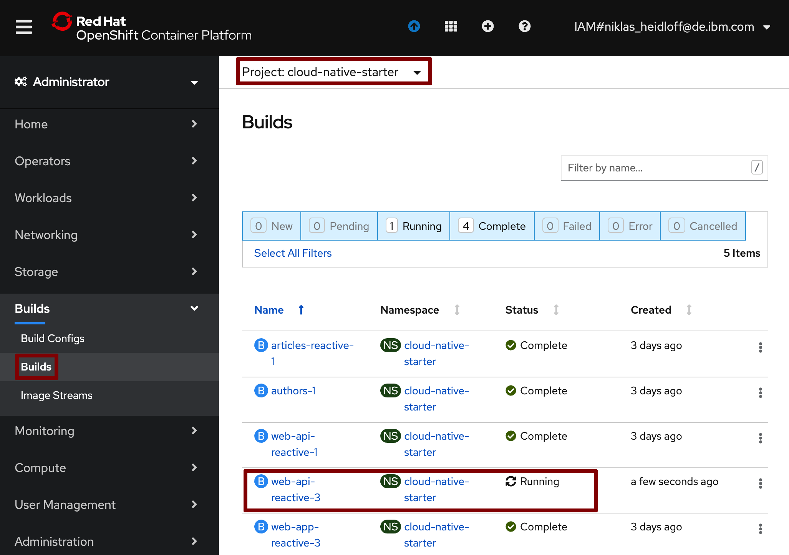
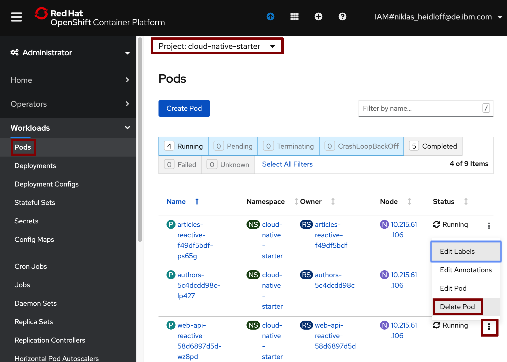

Navigator:
* [Workshop Description](https://ibm.github.io/workshop-quarkus-openshift-reactive-messaging/)
* Lab 1: [Create your Cloud Environment](lab1.md)
* Lab 2: [Deploy Kafka via Script](lab2.md)
* Lab 3: [Deploy Postgres via Operator](lab3.md)
* Lab 4: [Deploy Sample Application](lab4.md)
* Lab 5: [Reactive Messaging with MicroProfile](lab5.md)
* Lab 6: Server Sent Events
* Lab 7: [Vert.x Event Bus](lab7.md)
* Lab 8 (optional): [Use distributed Logging](lab8.md)

---

# Lab 6: Server Sent Events

In this lab you'll learn how to expose streaming endpoints so that web applications are notified via [Server Sent Events](https://developer.mozilla.org/en-US/docs/Web/API/Server-sent_events/Using_server-sent_events). 

The web application 'Web-App' receives notifications from the 'Web-API' service.



### Step 1: Understand the Web Application Consumer

Let's take a look at the JavaScript code which consumes the server side events.

A new EventSource is created by passing in the the URL of the streaming endpoint. The function source.onmessage is invoked when the events arrive. In our case this triggers the reload of the last articles.

```
$ cd ~/cloud-native-starter/reactive/web-app-reactive/src/components
$ cat Home.vue
```




### Step 2: Develop the Streaming Endpoint

The sample already comes with a working endpoint. Let's delete the file and recreate it from scratch.

```
$ cd ~/cloud-native-starter/reactive/web-api-reactive/src/main/java/com/ibm/webapi/apis/ 
$ rm NewArticlesStreamResource.java
$ touch NewArticlesStreamResource.java
$ nano NewArticlesStreamResource.java
```


Add the package name, the import statements and the empty class.

```
package com.ibm.webapi.apis;

import javax.inject.Inject;
import javax.ws.rs.core.MediaType;
import org.reactivestreams.Publisher;
import io.smallrye.reactive.messaging.annotations.Channel;
import javax.ws.rs.GET;
import javax.ws.rs.Path;
import javax.ws.rs.Produces;
import org.jboss.resteasy.annotations.SseElementType;

@Path("/v2")
public class NewArticlesStreamResource {
}
```

In [lab 5](lab5.md) you saw how to publish messages to the in-memory channel 'stream-new-article'. A publisher to this channel can easily be injected via @Inject and @Channel. 

```
    @Inject
    @Channel("stream-new-article") Publisher<String> newArticles;
```

Last, but not least, add the implementation of the streaming endpoint. The media type is MediaType.SERVER_SENT_EVENTS and the annotation @SseElementType defines the type.

```
    @GET
    @Path("/server-sent-events")
    @Produces(MediaType.SERVER_SENT_EVENTS) 
    @SseElementType("text/plain") 
    public Publisher<String> stream() { 
        return newArticles;
    }
```

Once you've entered everything the [class](https://github.com/IBM/cloud-native-starter/blob/master/reactive/web-api-reactive/src/main/java/com/ibm/webapi/apis/NewArticlesStreamResource.java) should look like this.



Exit the Editor via 'Ctrl-X', 'y' and 'Enter'.

### Step 3: Deploy new Version

```
$ cd ~/cloud-native-starter/reactive/web-api-reactive
$ oc start-build web-api-reactive --from-dir=.
```


On the 'Builds' page wait until the new build has been completed.



Once completed, delete the 'Web-API' pod which causes a new pod with the latest image to be started.



### Step 4: Verify new Version

Make sure all four pods in the 'cloud-native-starter' project are running. Note that it takes a couple of minutes until this happens.


To launch the application get the URLs via the following command.

```
$ ~/cloud-native-starter/reactive/os4-scripts/show-urls.sh
```


Open the web application in a browser. Then invoke the curl post command. The web application should show the new entry.


---

__Continue with [Lab 7: Vert.x Event Bus](lab7.md)__
