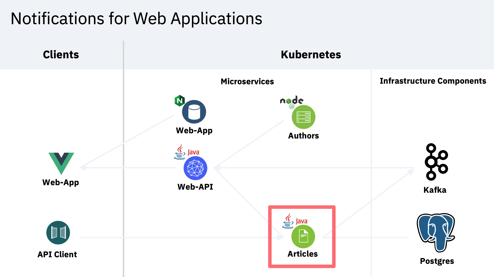
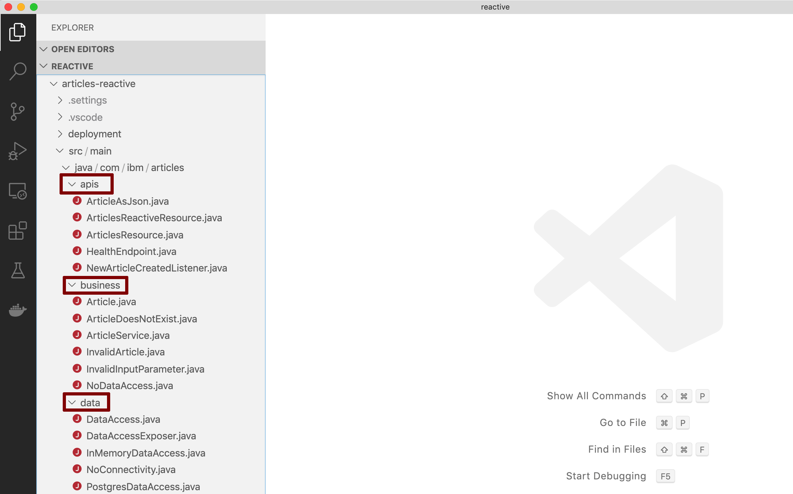
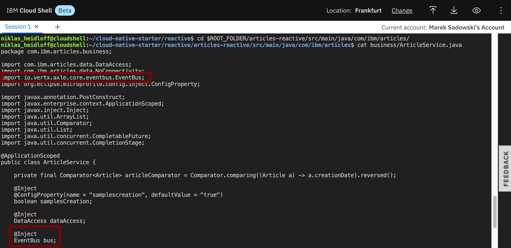
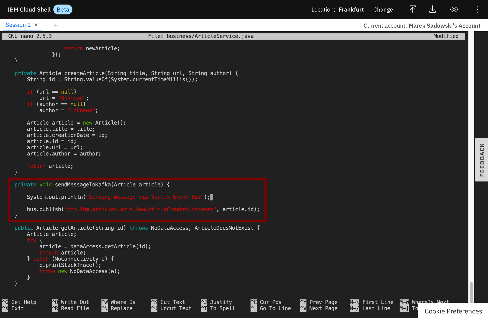
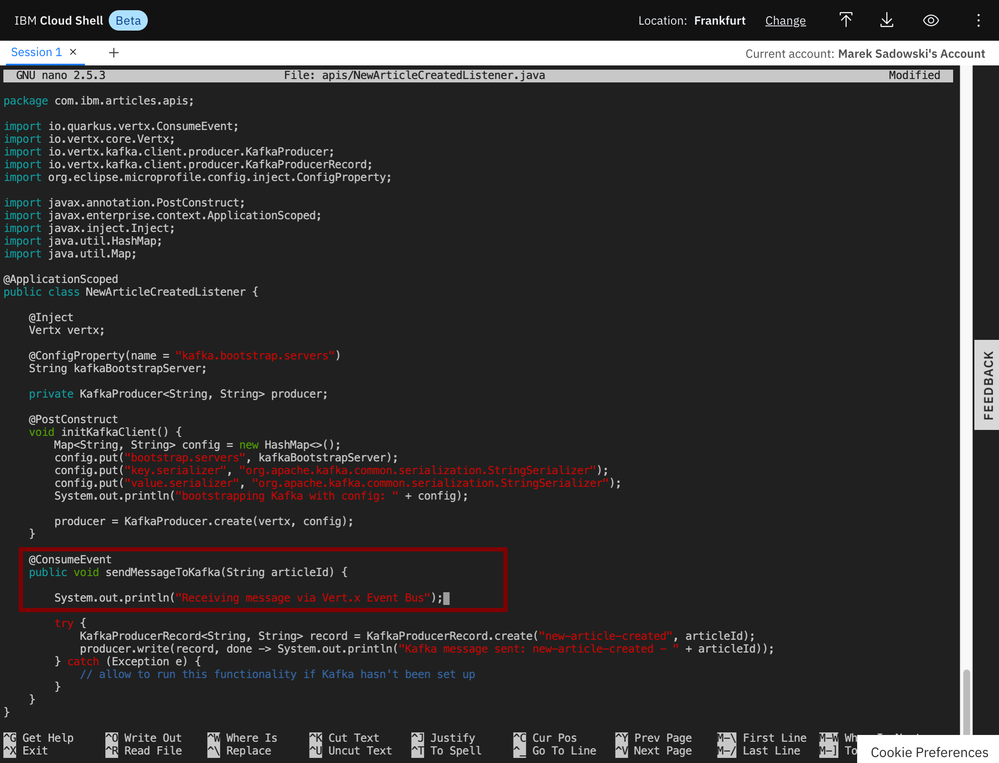
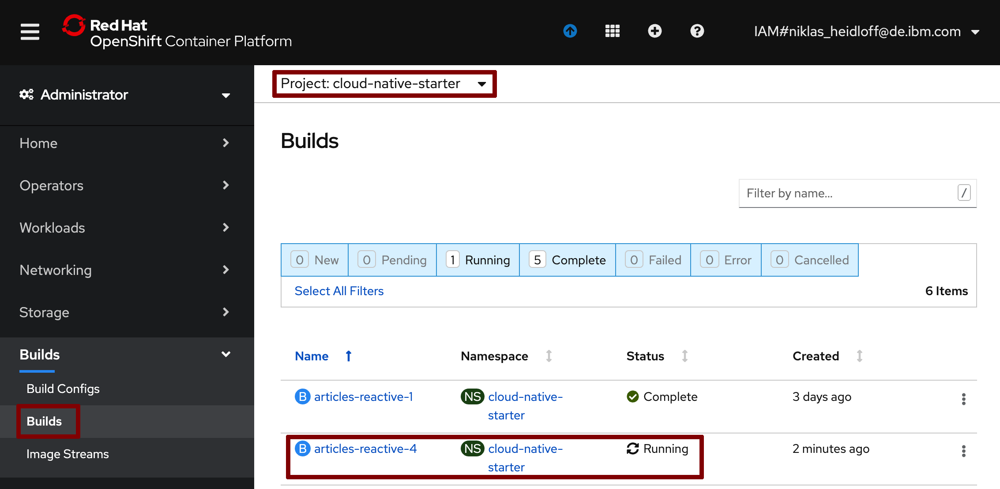
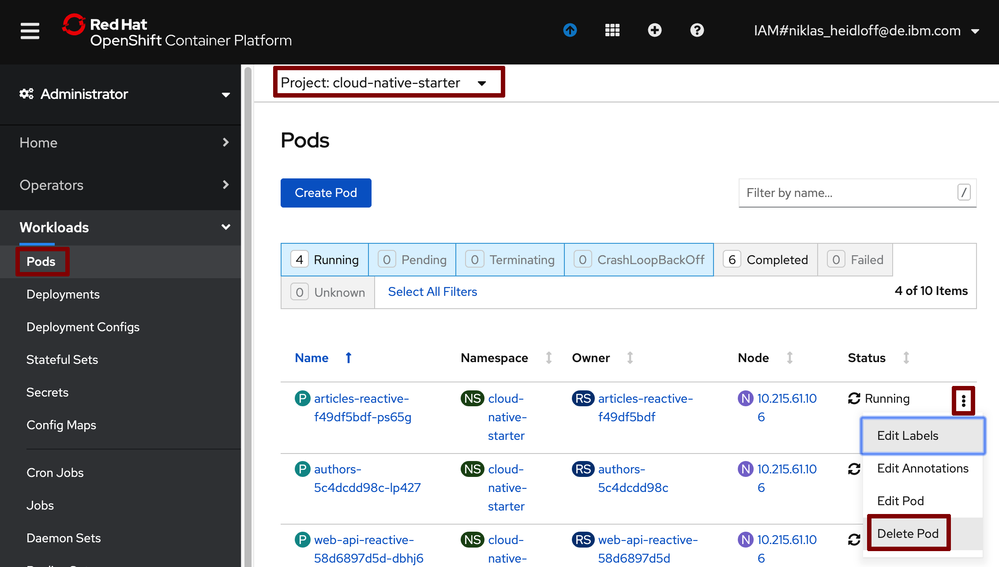
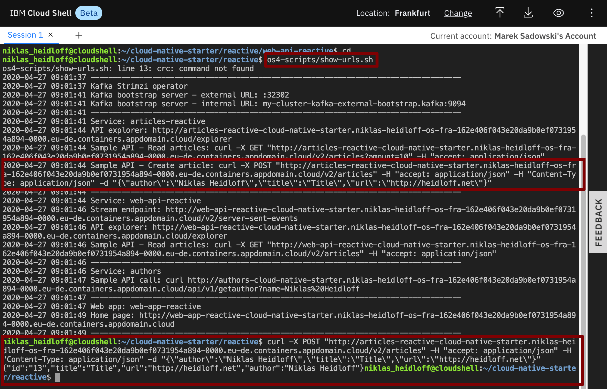
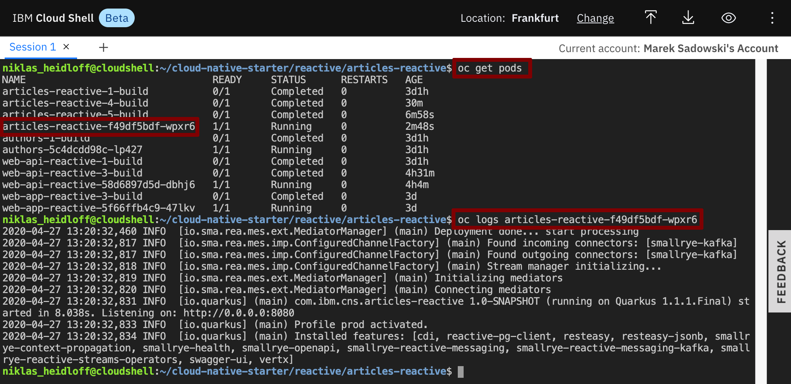
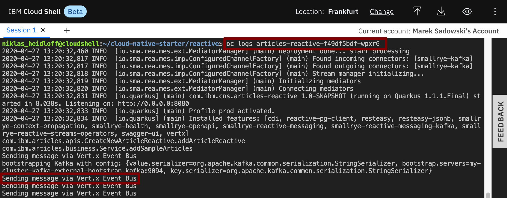

Navigator:
* [Workshop Description](https://ibm.github.io/workshop-quarkus-openshift-reactive-messaging/)
* Lab 1: [Create your Cloud Environment](lab1.md)
* Lab 2: [Deploy Kafka via Script](lab2.md)
* Lab 3: [Deploy Postgres via Operator](lab3.md)
* Lab 4: [Deploy Sample Application](lab4.md)
* Lab 5: [Reactive Messaging with MicroProfile](lab5.md)
* Lab 6: [Server Sent Events](lab6.md)
* Lab 7: Vert.x Event Bus
* Lab 8 (optional): [Use distributed Logging](lab8.md)

---

# Lab 7: Vert.x Event Bus

The [Vert.x Event Bus](https://vertx.io/docs/vertx-core/java/#event_bus) allows different parts of your application to communicate with each other. Check out the [guide](https://quarkus.io/guides/reactive-messaging) to find out more details.

In this lab you'll learn how to use the bus to communicate in-memory between different layers of the 'Articles' service.



The 'Articles' service uses a clean architecture approach. There are three different layers:

* API
* Business
* Data

The API layer contains the implementation of the REST APIs and the external messaging interfaces. The data layer contains the implementation of the persistence and could include calls to other external services. The API layer and the data layer can be easily replaced without changing the business logic.



In this lab you'll use the event bus to communicate between the business and the API layers.

### Step 1: Understand the Publisher

Let's take a look at the implementation of [ArticleService](https://github.com/IBM/cloud-native-starter/blob/master/reactive/articles-reactive/src/main/java/com/ibm/articles/business/ArticleService.java) in the business layer.

```
$ cd ~/cloud-native-starter/reactive/articles-reactive/src/main/java/com/ibm/articles/
$ cat business/ArticleService.java
```



An instance of the bus can be injected via @Inject.

Next let's modify the method 'sendMessageToKafka' slightly by adding a System.out.println.

```
System.out.println("Sending message via Vert.x Event Bus");
```

```
$ cd ~/cloud-native-starter/reactive/articles-reactive/src/main/java/com/ibm/articles/
$ nano business/ArticleService.java
```



Exit the Editor via 'Ctrl-X', 'y' and 'Enter'.

### Step 2: Understand the Subscriber


The method 'sendMessageToKafka' in the class [NewArticleCreatedListener.java](https://github.com/IBM/cloud-native-starter/blob/master/reactive/articles-reactive/src/main/java/com/ibm/articles/apis/NewArticleCreatedListener.java) in the API layer is invoked when the messages should be sent to Kafka. This is defined via the annotation @ConsumeEvent.

Let's modify this method slightly as well.

```
System.out.println("Receiving message via Vert.x Event Bus");
```

```
$ cd ~/cloud-native-starter/reactive/articles-reactive/src/main/java/com/ibm/articles/
$ nano apis/NewArticleCreatedListener.java
```



Exit the Editor via 'Ctrl-X', 'y' and 'Enter'.

### Step 3: Deploy new Version

```
$ cd ~/cloud-native-starter/reactive/articles-reactive
$ oc start-build articles-reactive --from-dir=.
```


Wait until the build has been completed.



Delete the articles pod. This will trigger Kubernetes to start a new pod with the latest version of the image.



### Step 4: Deploy new Version

Create a new article by invoking a curl post command. You can get the URL from the script show-urls.

```
$ ~/cloud-native-starter/reactive/os4-scripts/show-urls.sh
```



In order to see the logs, you can do two things:

1. Use the following instructions which leverage a terminal
2. Use distributed logging as documented in [lab 8](lab8.md)

In the terminal get the pod name:

```
$ oc get pods
```



After this invoke this command to display the logs of the pod.

```
$ oc logs articles-reactive-xxxxxxxxxxx-xxxxx
```



Your added line shows up in the logs now.

---

__Continue with [Lab 8: Use distributed Logging](lab8.md)__
